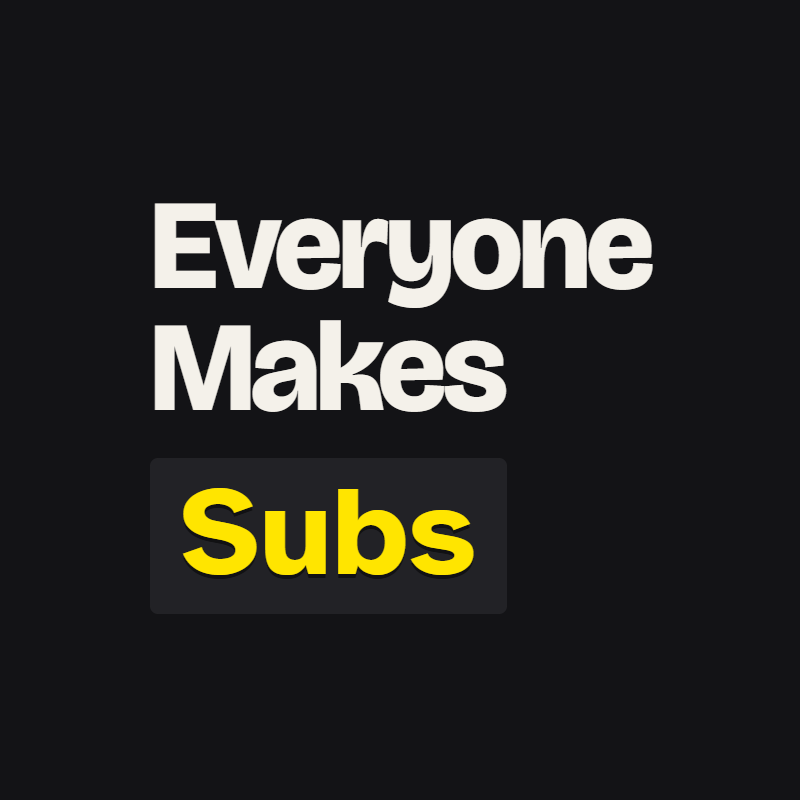
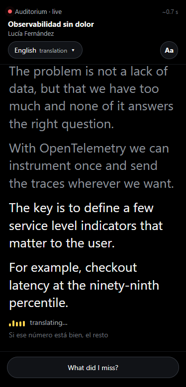
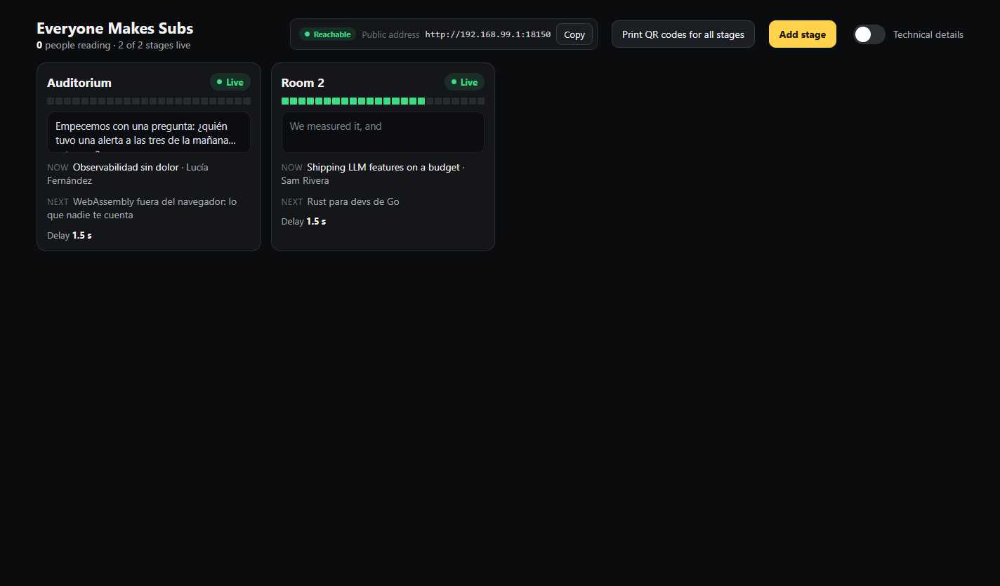
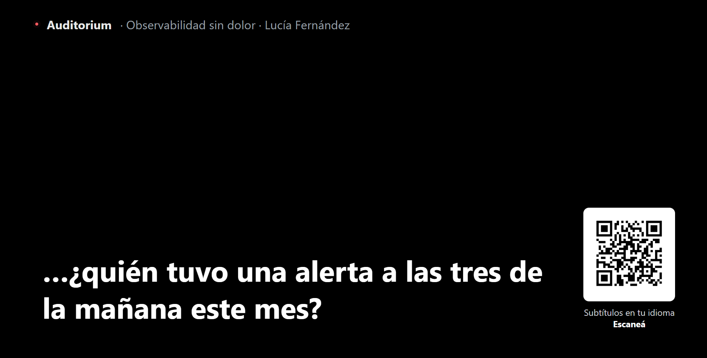

<p align="center"></p>

# Everyone Makes Subs

**Live captions and translation for every stage of your conference, with a single Gemini API key.**

Attendees scan the room's QR code and read what the speaker is saying on their phone, in the original language or translated into theirs. The organizer installs one app, pastes a key, pastes the agenda and connects the rooms. No developer needed.

Built for the **Nerdearla Vibeathon 2026**.

> 🎬 **[Pitch video (2:30, one chapter per judging criterion)](https://github.com/tomas-nobile/everyone-makes-subs/releases/download/v1.0.0/EveryoneMakesSubs-pitch.mp4)** — English talk in, Spanish captions out: a FOSDEM 2025 talk (CC BY) subtitled by the pipeline ([the Spanish VTT it produced](https://github.com/tomas-nobile/everyone-makes-subs/releases/download/v1.0.0/fosdem-2025-kubernetes-emissions-clip.es.vtt)), then Deploy → Quality → Latency → Scalability → Innovation → Price, every number from `bench/` and `docs/pricing.md`. The earlier [demo video (1:52)](https://github.com/tomas-nobile/everyone-makes-subs/releases/download/v1.0.0/EveryoneMakesSubs-demo.mp4) (a Nerdearla talk, Spanish → English) is still there.
>
> ⬇️ **[Download the Windows installer](https://github.com/tomas-nobile/everyone-makes-subs/releases/latest)** · or `docker compose up` (below).

| Phone (attendee) | Dashboard (operator) |
|---|---|
|  |  |



## What is in this repository

| | |
|---|---|
| [`everyone-makes-subs/`](everyone-makes-subs/) | The whole project: server, web, desktop app, specs, docs, benchmarks. Every command below runs inside it. |
| [`installers/`](installers/) | The Windows installer (`EveryoneMakesSubs-1.0.0-win-x64.exe`, Git LFS). Unsigned: *More info → Run anyway*. The same file and the videos are on the [Release v1.0.0](https://github.com/tomas-nobile/everyone-makes-subs/releases/tag/v1.0.0). |
| `README.md` | This file. |

## Try it in 1 minute (no key needed)

```bash
git clone https://github.com/tomas-nobile/everyone-makes-subs && cd everyone-makes-subs/everyone-makes-subs
npm install
npm run dev:fake          # http://localhost:5173 — 2 rooms replaying the samples (DEMO_STAGES=8 for a whole conference)
```

Open `/` (live now), `/s/auditorium?lang=es` (phone view: an English talk, Spanish captions), `/s/auditorium/tv`, `/admin` and `/setup`.

## Install

| Option | For | How |
|---|---|---|
| **Desktop app** | The production operator | Download the installer from [`installers/`](installers/) or the [latest release](https://github.com/tomas-nobile/everyone-makes-subs/releases/latest) and open it (Windows; build Mac/Linux with `npm run app:dist` on that OS). It is unsigned: on **Windows** click *More info → Run anyway*; on **Mac** right-click the app → *Open*. The app opens the setup wizard |
| **Docker** | A server, or judges | `cd everyone-makes-subs && GEMINI_API_KEY=… docker compose up --build` → http://localhost:8080. Without a key, the wizard asks for it. `DEMO=1` creates 2 sample rooms |
| **From source** | Developers | `cd everyone-makes-subs && npm install && npm run dev` (needs a key in `.env` or via `/setup`) |

`docker compose --profile advanced up` also starts **MediaMTX**, so OBS or a mixing console can push RTMP/SRT.

## First-run setup (`/setup`, no terminal)

1. **Connect Gemini:** paste an API key from [AI Studio](https://aistudio.google.com/apikey). "Test" runs a tiny translation and explains any error in plain words (invalid key, no access to the model, no quota). Stored in `data/config.json` with `0600` permissions.
2. **Dashboard password:** stored as a scrypt hash; the dashboard uses a signed `httpOnly` cookie.
3. **How phones get in:**
   - **Tailscale Funnel (recommended, free):** a 4-step checklist that detects Tailscale, signs you in, enables Funnel and tests the public `https://<machine>.<tailnet>.ts.net` address from outside.
   - **Cloudflare named tunnel:** paste the tunnel token and your hostname; the app runs `cloudflared`.
   - **Your own server** (`PUBLIC_URL`) or **this Wi-Fi only** (for testing).
   - ⚠️ The Cloudflare *quick* tunnel (`trycloudflare.com`) does not support SSE, so it can't carry captions.
4. **Rooms:** paste the agenda as it appears on the event website (Gemini turns it into rooms, talks and times, and prepares the vocabulary for each talk), create rooms by hand, or try the sample data.

## Audio sources

| In the dashboard | What it is |
|---|---|
| **Room laptop (recommended)** | Open the station link (`/station/<room>?key=…`) on a laptop plugged into the mixing console, pick the input, done. Big VU meter, "Test audio", 10 s buffer if the Wi-Fi hiccups |
| **YouTube or stream link** | Any YouTube URL (via yt-dlp, downloaded on first use) or anything ffmpeg can read (HLS, Icecast…) |
| **Audio file** | Upload a file; it plays in real time |
| **Advanced: OBS or console via RTMP/SRT** | Publish to `rtmp://<host>:1935/<path>` (MediaMTX) |

## Views

| Route | Who | |
|---|---|---|
| `/` | Attendee without a QR | Live now: every room with its current talk |
| `/s/:id` | Attendee (phone) | Auto language, big captions, bilingual mode, history, "what did I miss?", downloads when the talk ends, stream-delay mode |
| `/s/:id/tv?lang=&qr=1` | Room screen | 2 giant lines, QR in the corner, break card with the next talk |
| `/s/:id/overlay?lang=&lines=2&size=48&pos=bottom&box=1` | OBS browser source | Transparent background; configurator with preview in the dashboard |
| `/station/:id?key=` | Room laptop | Input picker, VU meter, sending status |
| `/admin` | Operator | Cards per room, alerts with the button that fixes them, side panel with talk/vocabulary, audio, share, downloads and technical details. **Subtitle a video:** upload a talk (or paste a YouTube link) and get it back with the subtitles burned in, plus VTT/SRT |
| `/setup` | First run | Key → password → access → rooms |

## Architecture

```
Source ─► AudioSource ─PCM16 16k 100ms─► Meter/VAD ─► Transcriber ──interim─► Segmenter
 station (WS)          audioClock =                 (Gemini Live,  ──final──►  │ commit
 url/youtube (ffmpeg)  bytes READ/32000             rotation on                ▼
 file (ffmpeg -re)                                  silence)              Translator (1 call,
 rtmp/srt (MediaMTX)                                                       all languages, JSON)
                                      EventBus (per stage, ring 300) ◄──────────┘
                                        ├─► SSE /api/stages/:id/stream  (phones, TV, overlay)
                                        ├─► Store JSONL ─► export SRT/VTT/TXT
                                        ├─► Summarizer (every 60 s, cached)
                                        └─► Metrics ─► SSE /api/admin/metrics (dashboard)
```

- **One SSE stream per room carries every language**: switching language never reconnects, and each room is transcribed and translated once no matter how many people watch.
- **Phrases, not paragraphs:** a LocalAgreement-2 segmenter commits text at a sentence end, at a comma after ~8 words, or after 4.5 s; the final is deduplicated against what was already published by aligning normalized words.
- **Sessions that don't drop:** Gemini Live sessions are rotated make-before-break at a pause of the speaker (hard cut with 2 s of overlap if nobody pauses) and reconnect on their own, re-sending buffered audio. `npm test -- rotation` checks 0 duplicates / 0 gaps.
- **Vocabulary per talk:** Gemini builds an ASR vocabulary, do-not-translate list and auto-corrections from the title and abstract; the dashboard shows each term's hit count ("Kubernetes ✓ 9").
- **Honest latency:** the dashboard shows the measured delay (p50/p95) for original and translation.

Stack: Node 22 + TypeScript + Fastify · `@google/genai` · ffmpeg-static + yt-dlp · Vite + React · JSON/JSONL files · Electron. Details in [`docs/architecture.md`](everyone-makes-subs/docs/architecture.md).

## Latency, measured

`npm run bench:latency` boots the real server with one file-source room (`samples/en.mp3`, an English talk, Spanish captions), connects one SSE client and times every phrase. Two honest numbers, never averaged together:

- **Heard → caption:** from the first ASR interim that contained the phrase's last word to the caption on the client. This is the pipeline's own delay (segmenter → translation → delivery).
- **Pause → caption:** from the speaker's pause that closed an utterance to the caption. It only exists for phrases the ASR closed on a pause — and on this speaker the Live API closes almost none (2 of 85 phrases), so it is not the number to quote. The phone's "~1.4 s" badge shows exactly this value when it exists, nothing else.

| `samples/en.mp3`, free-tier key, LAN | Before (baseline, 3 runs) | Shipped (2 runs) |
|---|---|---|
| Heard → original caption, p50 | 0.56 s | 0.78 s |
| Heard → Spanish caption, p50 | 3.35 s | **2.59 s** |
| Translation call, Spanish, p50 | 2.28 s | **1.33 s** |
| Delivery, server → client, p50 / p95 | 1 ms / 2 ms | 0 ms / 2 ms |
| Time to first caption after Start | 3.2 · 3.4 · 15.0 s | 19.8 · 6.5 s |
| Phrases left untranslated | 18 of 85 | 0 of 72 |

What moved the Spanish number: the translation is one streamed call with `es` first in the schema, published the moment its value closes (F17.4), over a kept-alive HTTPS connection (F17.5: first call after a pause 1.8 s → 1.1 s max in `bench-mt`). What did not: closing utterances on the speaker's pause — both the hybrid `audioStreamEnd` and the server-side `silenceDurationMs` were measured and rejected (`docs/decisions.md`). The p95s (up to 40 s) are the free tier: at 15 translation requests/minute per model the queue waits are the tail, and a fresh Live session can take 15–20 s to say its first word (run 1 of the shipped benchmark). On a billed project the fast segmenter set in `.env.example` takes heard → original to p50 0.52 s / p95 1.5 s (measured, 29 phrases/min). LAN numbers; attendees on phones go through Tailscale Funnel or a named Cloudflare tunnel, which adds its own hop. Machine: AMD Ryzen 5 3600, Windows 11, Node 25. Raw data: `bench/latency-*.json`; method and every rejected idea in `docs/decisions.md`.

## How to scale

1. **Up to ~10–15 rooms:** one laptop running the app, or a 2 vCPU container. The work is I/O-bound.
2. **More rooms or more reliability:** a server with Docker instead of a laptop; split `worker` and `web` roles with Redis pub/sub in place of the in-process EventBus (same publish/subscribe interface).
3. **Bigger audience:** SSE fan-out is cheap (a few hundred bytes per phrase); put `web` replicas behind a proxy/CDN. The AI cost does not change with the audience.
   Measured with `npm run load -- --stages=8 --clients=2000` (server and viewers on the same desktop, Ryzen 5 3600): **8 rooms × 250 viewers = 2,000 viewers, every phrase delivered to every viewer within 7 ms (p50) / 11 ms (p95) of each other, 44 % of one core, 103 → 157 MB of RAM**. Details and the raw JSON in [`docs/scale.md`](everyone-makes-subs/docs/scale.md).
4. **Quotas:** use a billed (Tier 1+) project. Each room holds up to 2 Live sessions during a rotation. One speech session per room — not per language, not per viewer.

## Costs

The AI cost depends on **rooms × hours**, never on the number of viewers:

- Transcription: Gemini Live, only while someone is speaking (silences over 2 s are not sent).
- Translation: one Flash-Lite call per phrase, returning every language at once.
- Vocabulary, agenda and the "what did I miss?" summary: one call per talk / per paste / per room per minute, cached and shared by everyone.

The dashboard's "Technical details" shows an estimated US$/hour per room.

## Free tier and data use

On Gemini's **free tier, Google may use the audio and text you send to improve its products**. The free tier is also small for a live event: 15 requests/minute per translation model and 20/day for `gemini-3.5-flash`. The system copes (a second model when one is out of quota, several phrases per request under load, the summary only while someone watches), but with 2+ rooms translations queue for several seconds and the dashboard says so. For a real event, use a project with billing enabled (paid tier), where your data is not used for training. The key never leaves your machine or server except to call Gemini.

## Limitations

- Accuracy depends on the room audio: a feed from the mixing console beats a laptop microphone.
- Tailscale Funnel has unpublished bandwidth limits: load test before a big event, or use Cloudflare.
- The desktop installers are unsigned.
- In "This Wi-Fi only" mode, room stations on *other* laptops can't use the microphone (browsers require HTTPS).

## Development

| Command | |
|---|---|
| `npm run dev` / `npm run dev:fake` | Server (8080) + Vite with hot reload; `:fake` replays `samples/` without a key |
| `npm run check` | Typecheck everything |
| `npm test` | vitest (segmenter, alignment, rotation, export, agenda parser) |
| `npm run smoke` | Boots the fake server and checks that captions arrive over SSE |
| `npm run build` / `npm start` | Production build of web + server |
| `npm run app:dist` | Desktop installer for the current OS (`app/release/`) |
| `npm run verify:live` | Real-key check of the Live API: answers the 3 open questions and logs them in `docs/decisions.md` |
| `npm run samples` | Runs the real pipeline over the 3 samples in parallel (report: t0/t1, delay p50/p95, vocabulary hits) and regenerates their `.transcript.json` |
| `npm run clip -- <youtube-url> --from=03:00 --to=03:40 --src-lang=en --lang=es` | A clip of a real talk with subtitles generated by the system, burned in (plus a replay transcript for the video) |
| `npm run demo-video [-- --replay]` | Builds the pitch video from the running system (Electron + ffmpeg): one chapter per judging criterion, every number read from `bench/` and `docs/pricing.json` |
| `npm run load -- --stages=8 --clients=2000` | N rooms × M SSE viewers: delivery spread per room, server CPU and RAM (`docs/scale.md`) |
| `npm run bench:latency -- --runs=3` | End-to-end latency benchmark on `samples/en.mp3`: pause → caption, heard → caption, delivery (`bench/latency-*.json`) |
| `npm run cost -- --rooms=2 --minutes=10` | Measured cost per room-hour from audio minutes and translation tokens (`docs/pricing.md`) |
| `npm run ab` | Same clip with and without the generated vocabulary; the lines where a term differs go to `demo/ab/` |
| `npx tsx server/scripts/check-speed.ts <video> --speeds=1,2,4` | How fast a video job can feed the Live API: transcript at each speed diffed against 1× (`JOB_SPEED`) |
| `npm run rec:desktop` | Desktop capture of the real install (Windows), timed with key presses, for the video's Deploy chapter |
| `npm run release` | Uploads the installers in `app/release/` to the GitHub Release `v<version>` |

## How it was built

Vibe-coded in one night with Claude Code: the specs live in [`specs/`](everyone-makes-subs/specs/) (one file per feature, with user stories and acceptance criteria), the rules for the agents in [`CLAUDE.md`](everyone-makes-subs/CLAUDE.md) and [`.claude/`](everyone-makes-subs/.claude/), and every decision taken on the way in [`docs/decisions.md`](everyone-makes-subs/docs/decisions.md). A backend agent and a frontend agent worked in parallel on `main`, with the SSE contract in [`shared/contract.ts`](everyone-makes-subs/shared/contract.ts) as the interface and a fake backend replaying the samples so the UI never waited for the pipeline.

## License

[MIT](LICENSE)
